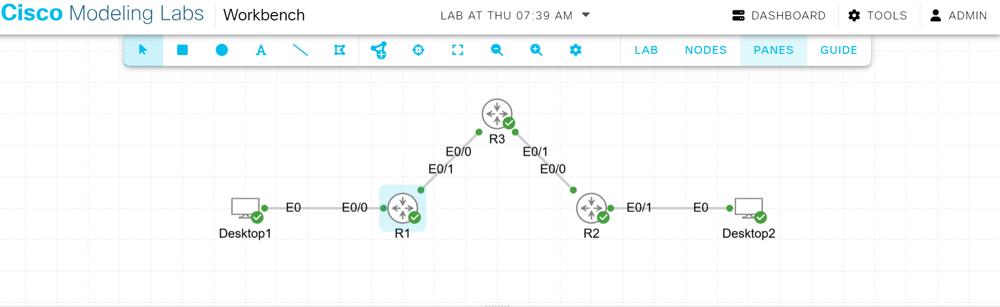
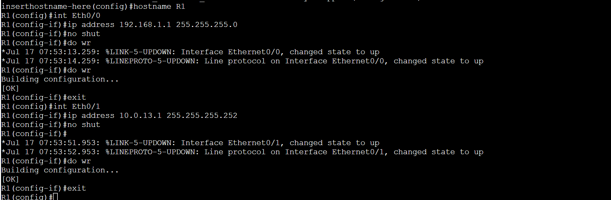
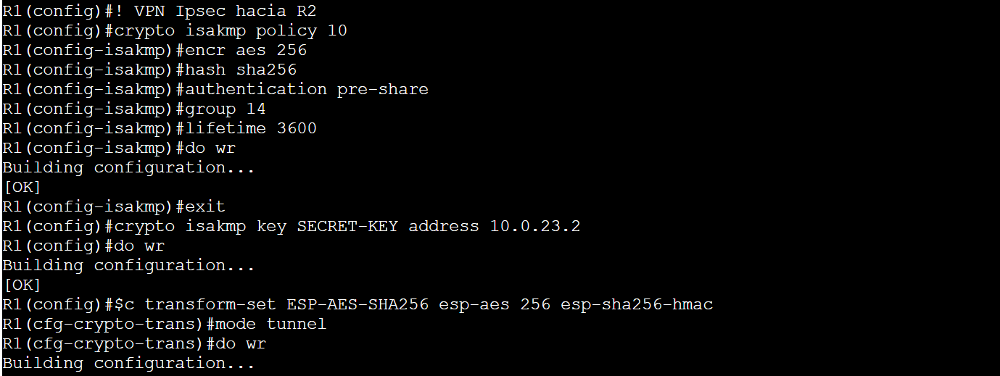
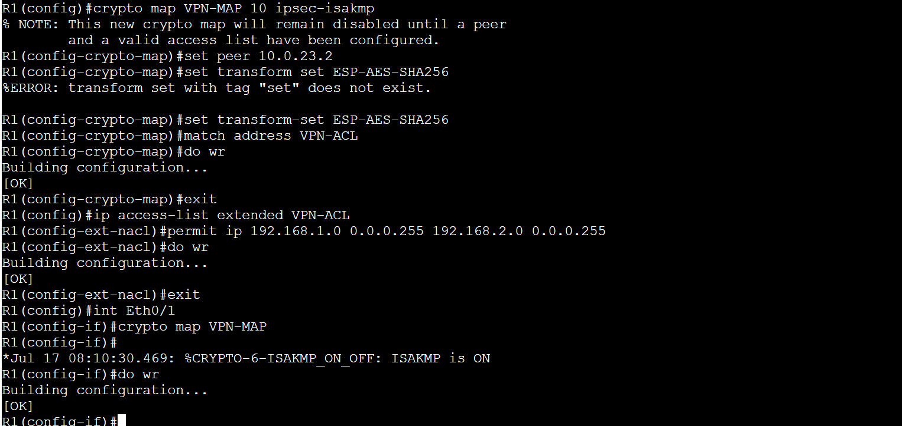
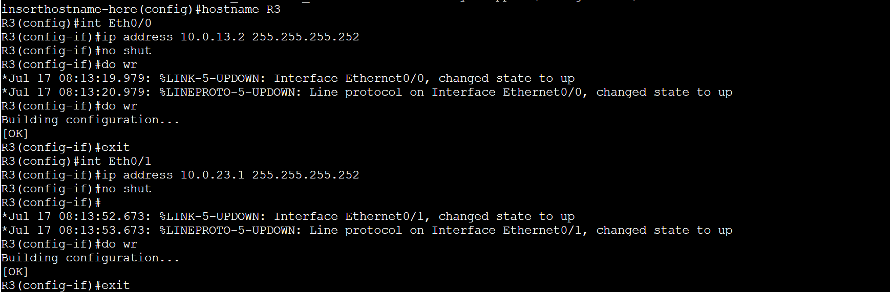
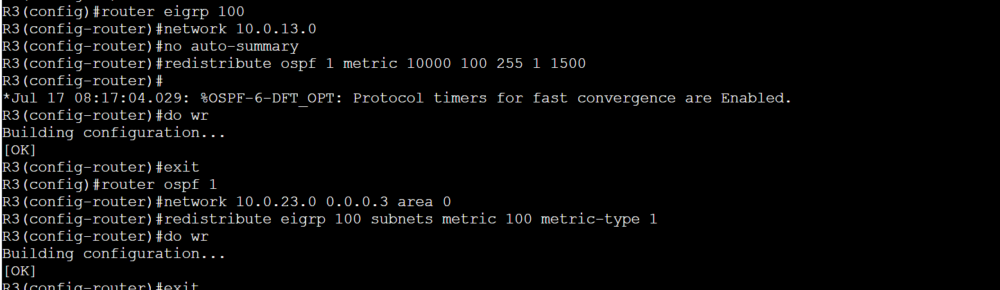
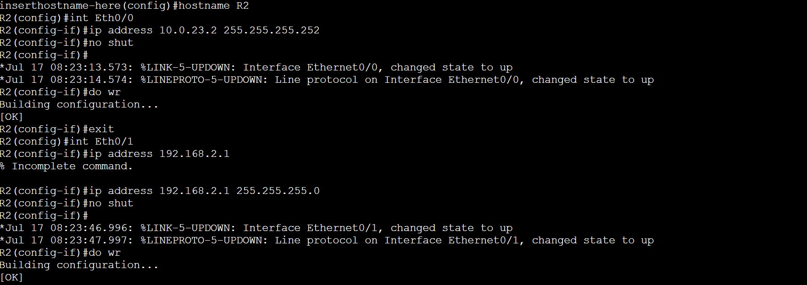

# IPSEC-ACL-VPN-EIGRP-OSPF.  

# 🖧 Topology 

# 🖥️ Desktop 1 configuration 

# 🛠️ R1 Configuration Interfaces. 

-R1 part 2 configuration. 

-R1 part 3 configuration. Routing Protocol EIGRP  

 
-R1 part 4 VPN configuration.

# 🛠️ R3 Configuration Interfaces

-R3 part 2 Routing Protocols EIGRP, OSPF

# 🛠️ R2 Configuration interfaces 

